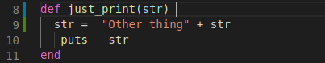
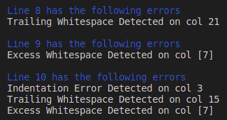
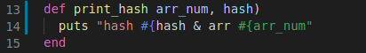
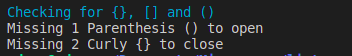
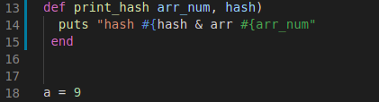
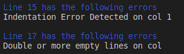

# Ruby Linter Capstone Proyect

> Building a linter tool for ruby files, that checks the basic sintax and points all the mistakes order by line and offset to find easily the error. 

Linter checks the following rules and the offset of each one:

 - Any trailing white space at the end of a line.
 - Two or more empty lines.
 - Two or more whitespace in a line.
 - Indentation inside a method.
 - Indentation without a method.

 The following rules also check the number of times that a:

 - Missing brackets open or close*.
 - Missing parentesis open or close*.
 - Missing curly brackets open or close*.

* It will not check whether if the close or open for each bracket, curly bracket or parenthesis are close in order.

## Repl

[Live Demo for main and tests](https://repl.it/@edxco/linter-capstone#README.md)

In the live view you can:
- Click run 
- Choose between bad or good files
- View results

## Screenshots

#### Example 1

#### Example 2

#### Example 3

## Getting started

To get your own copy of this project simply clone the repository to your local machine. For instructions on how to run this linter live, skip to the Repl.It instructions below and then click on the Repl.It badge.

**Step 1**: Type the following command into a git shell

<code>git clone <https://github.com/edxco/linter-capstone.git></code>

**Step 2**: Direct a terminal into the directory of the cloned repository by typing:

<code>cd linter-capstone</code>

### With your terminal in the cloned directory:

**Step 3**: Install the current stable version of Ruby:

<code>$ ruby-install ruby</code>

**Step 4**: Add this lines to your application's Gemfile:

<code>gem 'rspec'
gem 'strscan'</code>

**Step 5**: And then execute:

<code>$ bundle install</code>

**Step 6**:  type the following command:

<code>ruby ./bin/linter</code>

**Step 7**: When prompted, choose between any of the to examples that ask for

**Setp 8**: If you need to test a file you can change bad.rb or good.rb, save it and repeat step 3

## To Test with Rspec

**Step 1**: Direct a local terminal to the cloned repository.

**Step 2**: Go to the root of the repository and enter the following command:

<code> rspec</code>

## Authors

👤 **Eduardo Baeza**

- GitHub: [@githubhandle](https://github.com/edxco/)
- Twitter: [@twitterhandle](https://twitter.com/lalo_nbc/)
- LinkedIn: [LinkedIn](https://www.linkedin.com/in/eduardo-n-baeza/)

## 🤝 Contributing

Contributions, issues and feature requests are welcome!

Feel free to check the [issues page](issues/).

## Show your support

Give a ⭐️ if you like this project!